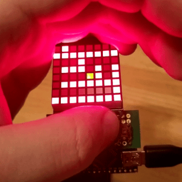
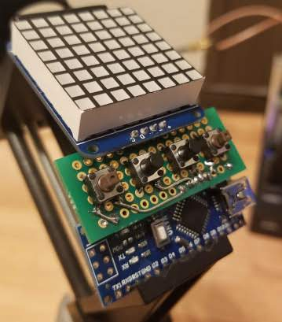
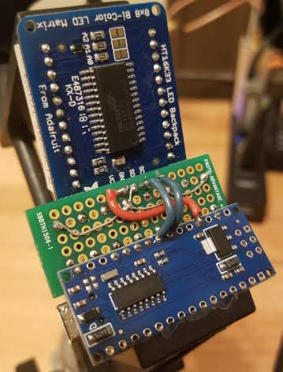

# arduino_bigmaze
A fun maze game for an arduino with an 8x8 display!

Game notes:
 - You can progress through an arbitrary number of pre-defined levels
 - You always start in the upper left and exit in the bottom right
 - Levels are static and automatic code generation is used to build them into the source code

Hardware notes:
 - uC is a knockoff Arduino nano that I got from Taipei
 - Screen is an Adafruit Bicolor 8x8 matrix
 - Buttons are randoms that I found in my drawer

## Files in the repo:
 - **`arduino_bigmaze.ino`** - The game's C source code for arduino
 - **`levels.h`** - All the data for the mazes are stored here. This file is included by `bigmaze.ino` and autogenerated by `make_levels_h.py`
 - **`make_levels_h.py`** - Generates levels.h using the level descriptions in `levels.py`
 - **`levels.py`** - Contains raw level descriptions generated by `wilsons.html`
 - **`wilsons.html`** - Generates mazes using Wilson's algorithm. This file comes from Mike Bostock's [fantastic demo](https://bl.ocks.org/mbostock/11357811) and was gently modified to output the maze description as a string that can be pasted into a row of `levels.py`
